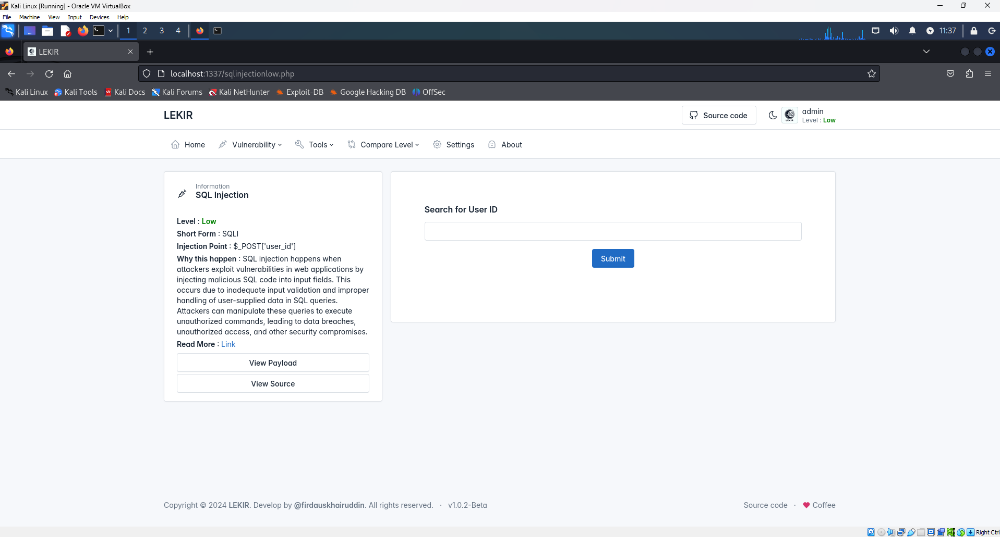
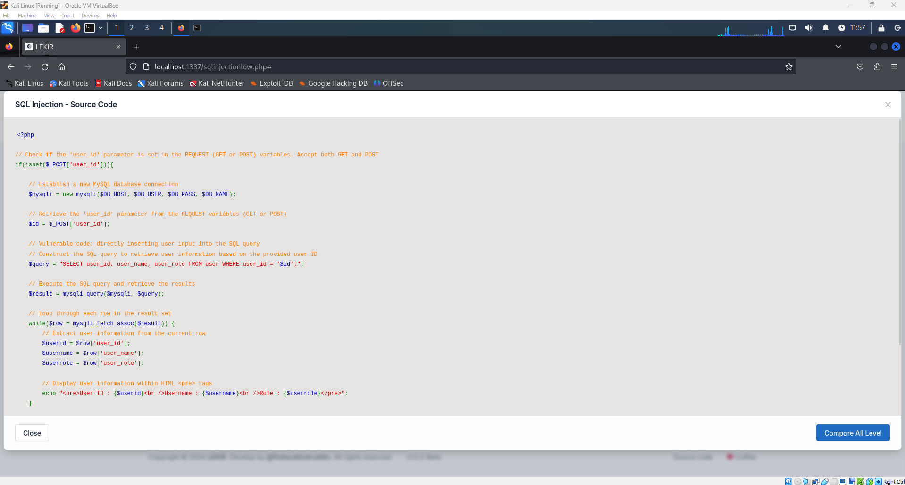
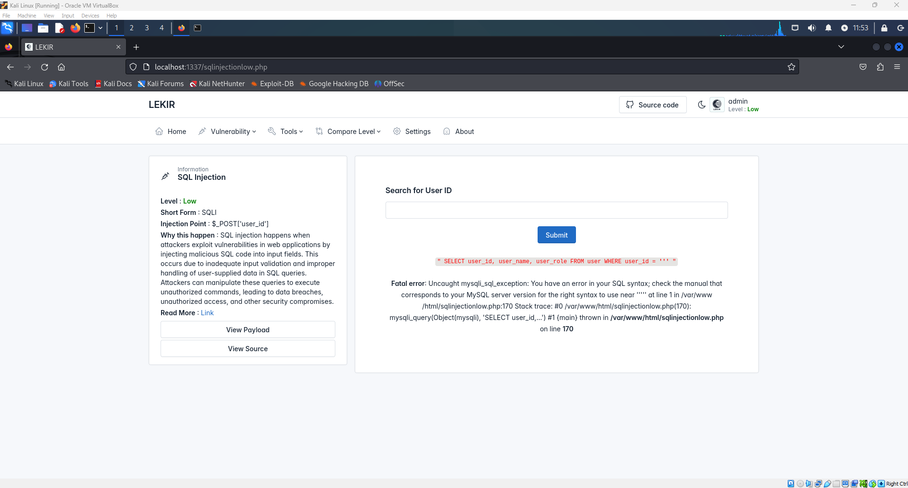
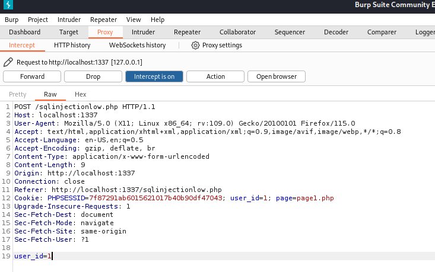
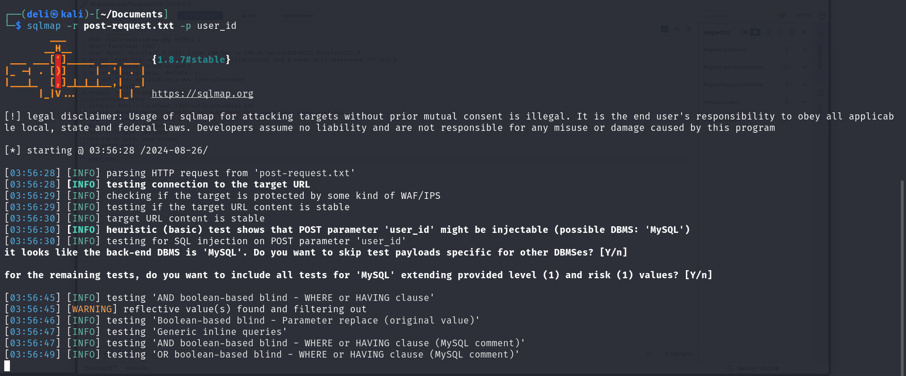
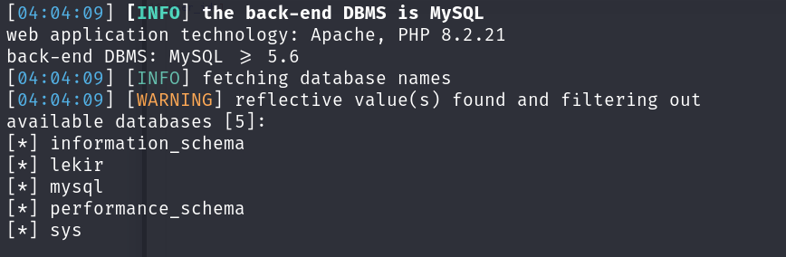

# SQL Injection
Here in LEKIR, we have a challenge that vulnerable to SQL injection. We can manipulate the input fields to execute arbitrary SQL code on a database.

## Tools
- Burp Suite
- SqlMap

## Identifying Vulnerabilities
First, we need to identify if this page is vulnerable to sql injeciton.  
In this case, we already have the source code. View the source code and search for the line that handle the SQL query. Usually the developer will named the variable with $query or $q.

Based on how the code wrote, we know that the page is vulnerable to sql injection.
Another way to identify is by inserting a special character like ' or " in the input field. Then you will see there is an error respond on the page.

> [!NOTE]
> There will be some situation that will return the blind error which will not giving us any error respond on the page after you inserted the character. This will make it difficult for us when we want to identify if the page is vulnerable or not.

## Intercept the POST Request
Open your burp suite and turn on the intercept in proxy tab. Go back to your target site and enter anything in the input field. After you click on the submit button, burp will catches the **POST request** and waits.

Copy the POST request to a text file. Create your text file manually or using the following commands:  

Creating the text file 
`
touch post-request.txt
`

Open text editor and paste the copy 
`
nano post-request.txt
`

> [!NOTE]
> Don't forget to save before you exit.

## Implementing SQL Injection

Run sqlmap as shown below; the option `-r` tells sqlmap to read the post-request.txt file to get the information to attack in the POST request. `-p` is the parameter we are attacking. `--dbs` will show the available databases.  The parameter that we are attacking is user_id. 

`
sqlmap -r post-request -p user_id --dbs
`

I can see that there is a database named lekir which refers to my target site. So now, I want to look for the tables that avaible in this database. Since we know the name of the db, we can use this option `-D` follow by the name of the db to select the db. `--tables` is to show the tables that are avaible in this db
 
`
sqlmap -r post-request -p user_id -D lekir --tables
`
